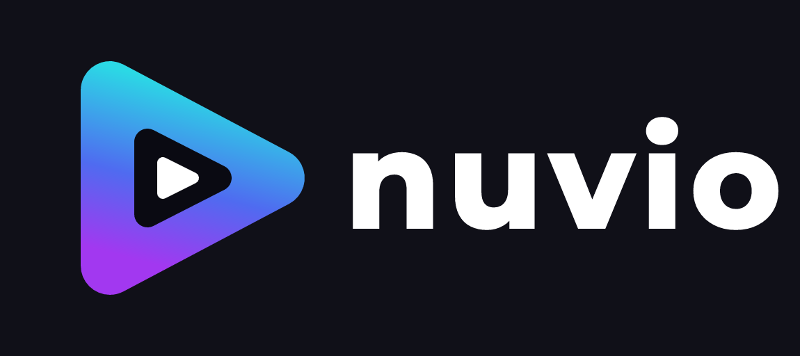
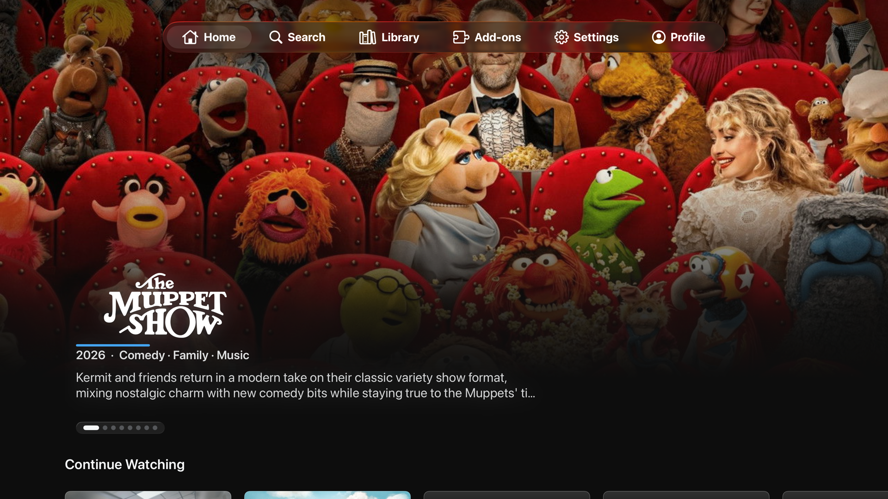
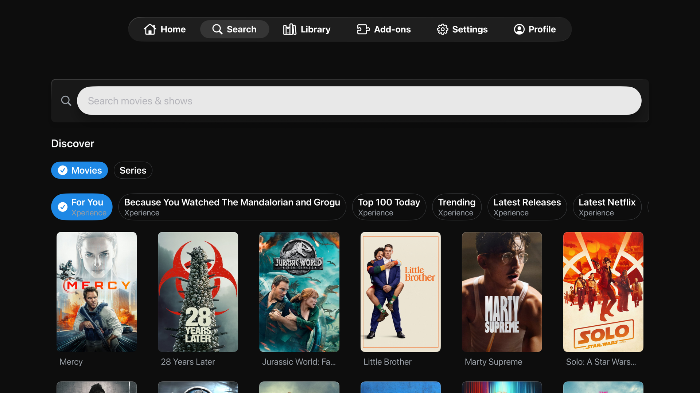
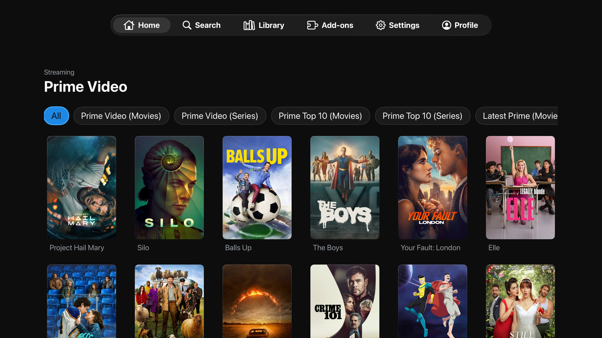
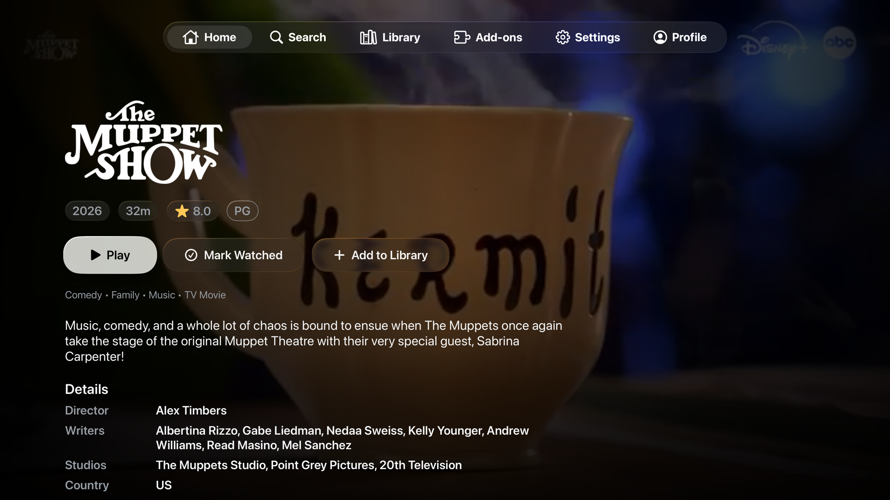
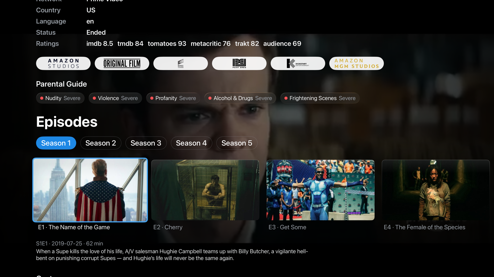
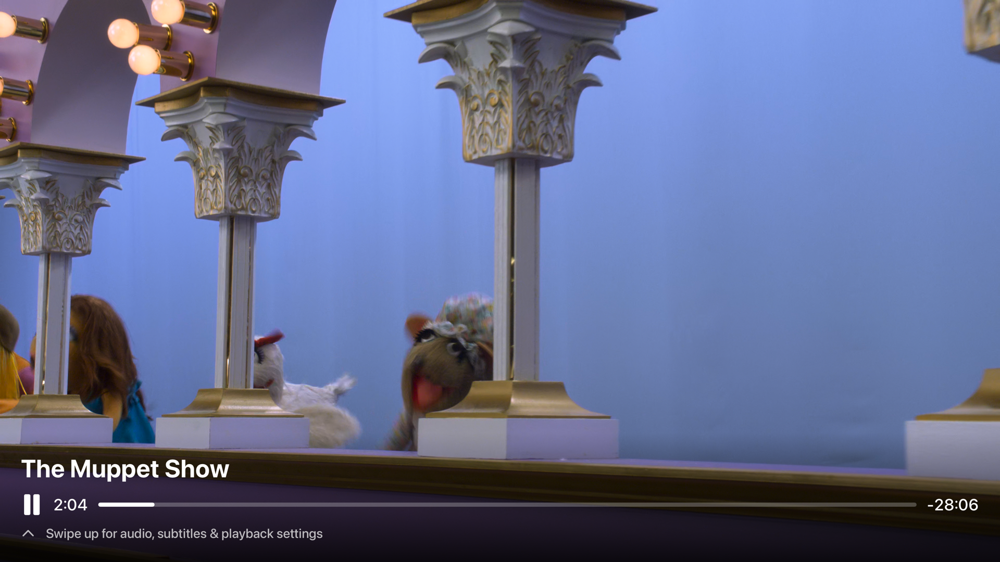
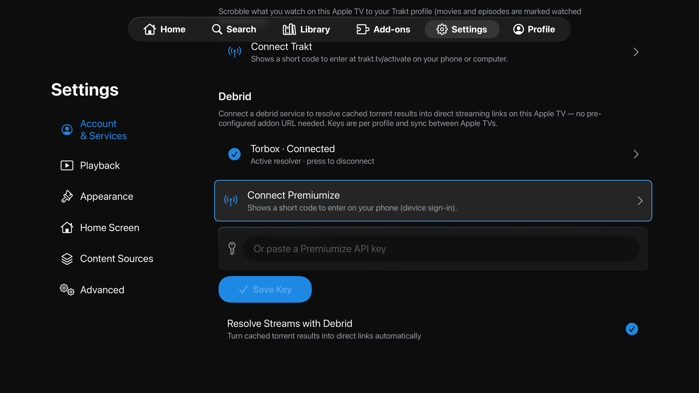

<div align="center">

  
  <br />
  <br />

  [![Contributors][contributors-shield]][contributors-url]
  [![Forks][forks-shield]][forks-url]
  [![Stargazers][stars-shield]][stars-url]
  [![Issues][issues-shield]][issues-url]
  [![License][license-shield]][license-url]

  <p>
    A native Apple TV client for the Nuvio media hub — SwiftUI on top of a shared Kotlin Multiplatform core.
    <br />
    Stremio addon ecosystem • Built for the tvOS focus engine &amp; Siri Remote
  </p>

</div>

## About

**NuvioTV** is a native **tvOS (Apple TV)** port of [Nuvio](https://github.com/NuvioMedia/NuvioMobile). It brings Nuvio's playback-focused experience — the Stremio addon ecosystem, catalogs, watch progress, collections, cloud library, debrid, and Trakt — to the living room with an interface designed from the ground up for the **tvOS focus engine** and the **Siri Remote**.

Rather than port the touch UI, this fork keeps only what travels well: the proven, Compose-free **domain and data layer** from NuvioMobile is lifted into a UI-free Kotlin Multiplatform framework — **`SharedCore`** — and a brand-new **SwiftUI** frontend is built on top of it. The result is one shared business-logic core across mobile and TV, with a purpose-built 10-foot experience on Apple TV.

> **Lineage:** the original *NuvioTV* was a React Native app; it was rewritten as [**NuvioMobile**](https://github.com/NuvioMedia/NuvioMobile) (Kotlin / Compose Multiplatform) for Android and iOS. This project reclaims the *NuvioTV* name for a true Apple TV app — sharing NuvioMobile's core while replacing the UI and player for tvOS.

## Screenshots

| | |
|:---:|:---:|
|  <br/> **Home** — hero carousel & Continue Watching |  <br/> **Search** — Discover rows from your addons |
|  <br/> **Catalogs** — addon catalogs with filter chips |  <br/> **Detail** — metadata, ratings & quick actions |
|  <br/> **Series** — season chips & episode shelf |  <br/> **Player** — native AVPlayer path, platter-free controls |
|  <br/> **Debrid** — device-code or API-key sign-in | |

## Features

### True 10-foot UI

- **Native SwiftUI** built around the tvOS focus engine — focusable poster cards with parallax depth lift, D-pad-first navigation throughout.
- **Home hero carousel** with auto-advance and manual D-pad paging.
- **Floating pill navigation bar**, horizontal episode shelves, and watched-episode badges.
- **Continue Watching** with a separate Upcoming row for not-yet-released next episodes.
- **Top Shelf extension** — your content surfaces directly on the Apple TV home screen.

### Stremio addon ecosystem

- Install **Stremio-compatible addons** for catalogs, metadata, streams, and subtitles.
- An **on-device QuickJS runtime** executes addon logic natively — no external server.
- Install addons in-app or from the web (`stremio://` links are picked up on account sync).

### Playback

- **Hybrid player** — a native AVPlayer path with on-device MKV remuxing: **Dolby Vision** (including Profile 7 → 8.1 conversion via libdovi), **TrueHD / DTS audio transcoding**, and full seek-anywhere support.
- **libmpv player** (via MPVKit) for everything else, with HDR tone-mapping (`gpu-next`).
- **Addon subtitles in both players** (SRT → WebVTT renditions on the native path), with forced/audio-aware subtitle auto-selection.
- **Skip intro**, Play Next, next-episode autoplay, and a Stream Info panel (video/audio/subtitle state at a glance).

### Sources & accounts

- **Debrid support** — connect with a device code or API key; cached results resolve to direct streams, with quality / codec / service badges in the stream picker.
- **Trakt scrobbling** — movies and episodes marked watched automatically.
- **TMDB / MDBList** metadata, catalog-type and release-date display options.
- **Profiles with PIN entry** and QR / remote-setup sign-in flows.
- **Cloud library sync**, collections, and a sortable library with shelf and grid layouts.

## Requirements

- An **Apple TV** running **tvOS 26** or later (or the Apple TV simulator).
- **macOS** with **Xcode 26** or later.
- A recent **JDK**, used by Gradle to build the `SharedCore` Kotlin framework.

## Installation (Beta)

Beta builds ship as an **unsigned tvOS IPA** on the [**Releases page**](https://github.com/youngchris29-art/NuvioTV/releases/latest) — no paid Apple Developer account needed. You sideload it with a **free Apple ID**; the signature is created on your machine at install time.

1. Download `NuvioTV.ipa` from the [latest release](https://github.com/youngchris29-art/NuvioTV/releases/latest).
2. Sideload it to your Apple TV with one of:
   - [**Sideloadly**](https://sideloadly.io/) (Mac / Windows) — detects Apple TVs over the local network; pair the Apple TV if prompted (Settings → Remotes and Devices → Remote App and Devices shows the pairing code). If you hit an "App ID limit" error, enable **Remove app extensions** under Advanced (you only lose the Top Shelf row).
   - [**atvloadly**](https://github.com/bitxeno/atvloadly) — a self-hosted (Docker) web UI that sideloads over the network and can re-sign automatically.
3. On first launch, trust the developer certificate on the Apple TV (Settings → General → Privacy & Security).

> **Free Apple ID limits** (normal, not bugs): the app's signature expires after **7 days** — just re-sideload (both tools can automate the refresh) — and a free account allows at most **3 sideloaded apps** at a time.

Every beta is a fresh build with no account or addons baked in — sign in and set up your own sources on first launch. Prefer building from source? See [Development](#development) below.

## Development

```bash
# 1. Clone with submodules (pulls the NuvioMobile core; MPVKit lives inside it)
git clone --recurse-submodules https://github.com/youngchris29-art/NuvioTV.git
cd NuvioTV/NuvioMobile
git submodule update --init --recursive

# 2. One-time: build the tvOS QuickJS runtime into your local Maven
../scaffolding/build-quickjs-tvos.sh

# 3. Open the Xcode project, then build & run the NuvioTV scheme on an Apple TV
open iosApp/iosApp.xcodeproj
```

Building the app triggers the Gradle task that produces the `SharedCore` framework and links it into the tvOS target. For the full setup and architecture, see [`docs/tvos-port-plan.md`](docs/tvos-port-plan.md) and [`scaffolding/README.md`](scaffolding/README.md).

Versioning is driven from [`NuvioMobile/iosApp/Configuration/Version.xcconfig`](NuvioMobile/iosApp/Configuration/Version.xcconfig), the shared source of truth for both the mobile and tvOS builds.

### Project Structure

- `NuvioMobile/` — the shared Nuvio core as a Git submodule (this fork's `tvos-shared-extraction` branch); holds the Kotlin Multiplatform code and the Xcode project.
  - `NuvioMobile/shared/` — the UI-free **`SharedCore`** KMP framework (domain + data layer) consumed by the tvOS app.
  - `NuvioMobile/iosApp/NuvioTV/` — the native **SwiftUI** tvOS app (`Screens/`, `DesignSystem/`, `Bridge/`).
  - `NuvioMobile/iosApp/NuvioTopShelf/` — the tvOS **Top Shelf** extension.
  - `NuvioMobile/iosApp/iosApp.xcodeproj` — the Xcode project; build the **`NuvioTV`** scheme.
- `design/` — brand assets (logo, marks, previews).
- `docs/` — port plan, feature-parity roadmap, and scouting / migration reports.
- `scaffolding/` — Phase 0 templates and the tvOS QuickJS build script / patch.

## Built With

- SwiftUI + the tvOS focus engine
- Kotlin Multiplatform (`SharedCore`)
- AVFoundation / AVKit
- libmpv via [MPVKit](https://github.com/mpvkit/MPVKit)
- Ktor + kotlinx-serialization
- Supabase (auth / postgrest / functions)
- QuickJS (`quickjs-kt`, tvOS fork) for the Stremio addon runtime

## Credits & Upstream

NuvioTV stands on the shoulders of the Nuvio project:

- [**NuvioMedia/NuvioMobile**](https://github.com/NuvioMedia/NuvioMobile) — the Kotlin / Compose Multiplatform app this fork extends and tracks. `SharedCore` is built from its domain / data layer, and this repo periodically merges upstream changes.
- [**tapframe/NuvioTV**](https://github.com/tapframe/NuvioTV) — the original React Native app that started it all.

This is an independent, community fork focused on Apple TV. It is not affiliated with or endorsed by the upstream maintainers.

## Legal & DMCA

Nuvio functions solely as a client-side interface for browsing metadata and playing media provided by user-installed extensions and/or user-provided sources. It is intended for content the user owns or is otherwise authorized to access.

Nuvio is not affiliated with any third-party extensions, catalogs, sources, or content providers. It does not host, store, or distribute any media content.

For comprehensive legal information, including the full disclaimer, third-party extension policy, and DMCA / Copyright information, please visit the [Legal & Disclaimer Page](https://nuvioapp.space/legal).

## License

Distributed under the **GNU General Public License v3.0**, inherited from [NuvioMobile](https://github.com/NuvioMedia/NuvioMobile/blob/main/LICENSE). See [`NuvioMobile/LICENSE`](NuvioMobile/LICENSE).

## Star History

<a href="https://www.star-history.com/#youngchris29-art/NuvioTV&type=date&legend=top-left">
 <picture>
   <source media="(prefers-color-scheme: dark)" srcset="https://api.star-history.com/svg?repos=youngchris29-art/NuvioTV&type=date&theme=dark&legend=top-left" />
   <source media="(prefers-color-scheme: light)" srcset="https://api.star-history.com/svg?repos=youngchris29-art/NuvioTV&type=date&legend=top-left" />
   
 </picture>
</a>

<!-- MARKDOWN LINKS & IMAGES -->
[contributors-shield]: https://img.shields.io/github/contributors/youngchris29-art/NuvioTV.svg?style=for-the-badge
[contributors-url]: https://github.com/youngchris29-art/NuvioTV/graphs/contributors
[forks-shield]: https://img.shields.io/github/forks/youngchris29-art/NuvioTV.svg?style=for-the-badge
[forks-url]: https://github.com/youngchris29-art/NuvioTV/network/members
[stars-shield]: https://img.shields.io/github/stars/youngchris29-art/NuvioTV.svg?style=for-the-badge
[stars-url]: https://github.com/youngchris29-art/NuvioTV/stargazers
[issues-shield]: https://img.shields.io/github/issues/youngchris29-art/NuvioTV.svg?style=for-the-badge
[issues-url]: https://github.com/youngchris29-art/NuvioTV/issues
[license-shield]: https://img.shields.io/github/license/youngchris29-art/NuvioTV.svg?style=for-the-badge
[license-url]: https://github.com/youngchris29-art/NuvioTV/blob/main/LICENSE
