<div align="center">

  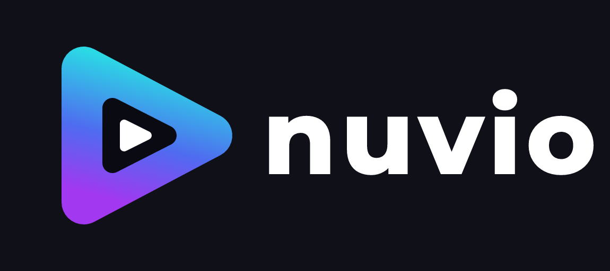
  <br />
  <br />

  [![Contributors][contributors-shield]][contributors-url]
  [![Forks][forks-shield]][forks-url]
  [![Stargazers][stars-shield]][stars-url]
  [![Issues][issues-shield]][issues-url]
  [![License][license-shield]][license-url]

  <p>
    A native Apple TV client for the Nuvio media hub — SwiftUI on top of a shared Kotlin Multiplatform core.
    <br />
    Stremio addon ecosystem • Built for the tvOS focus engine &amp; Siri Remote
  </p>

</div>

## About

**NuvioTV** is a native **tvOS (Apple TV)** port of [Nuvio](https://github.com/NuvioMedia/NuvioMobile). It brings Nuvio's playback-focused experience — the Stremio addon ecosystem, catalogs, watch progress, collections, cloud library, debrid, and Trakt — to the living room with an interface designed from the ground up for the **tvOS focus engine** and the **Siri Remote**.

Rather than port the touch UI, this fork keeps only what travels well: the proven, Compose-free **domain and data layer** from NuvioMobile is lifted into a UI-free Kotlin Multiplatform framework — **`SharedCore`** — and a brand-new **SwiftUI** frontend is built on top of it. The result is one shared business-logic core across mobile and TV, with a purpose-built 10-foot experience on Apple TV.

> **Lineage:** the original *NuvioTV* was a React Native app; it was rewritten as [**NuvioMobile**](https://github.com/NuvioMedia/NuvioMobile) (Kotlin / Compose Multiplatform) for Android and iOS. This project reclaims the *NuvioTV* name for a true Apple TV app — sharing NuvioMobile's core while replacing the UI and player for tvOS.

## Screenshots

| | |
|:---:|:---:|
| 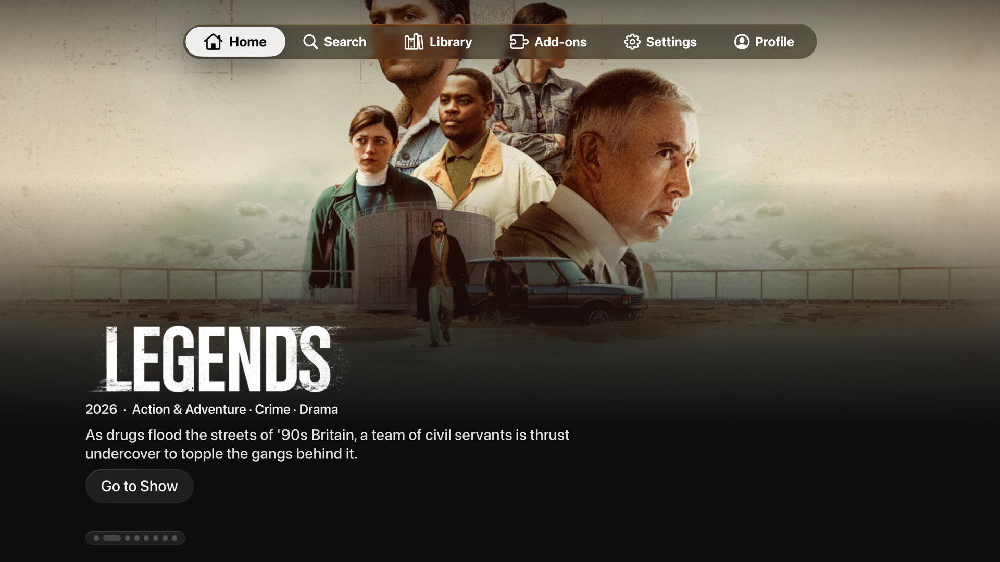 <br/> **Home** — hero carousel & Continue Watching | 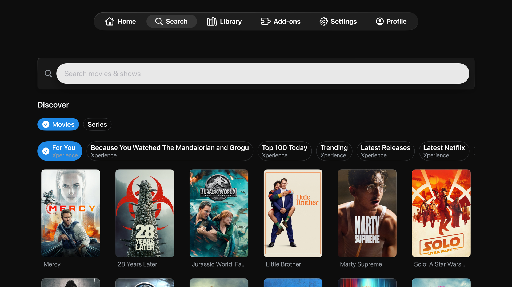 <br/> **Search** — Discover rows from your addons |
| 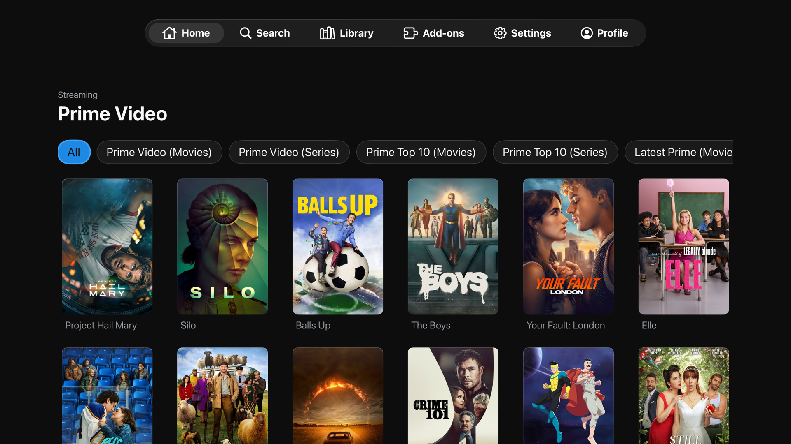 <br/> **Catalogs** — addon catalogs with filter chips | 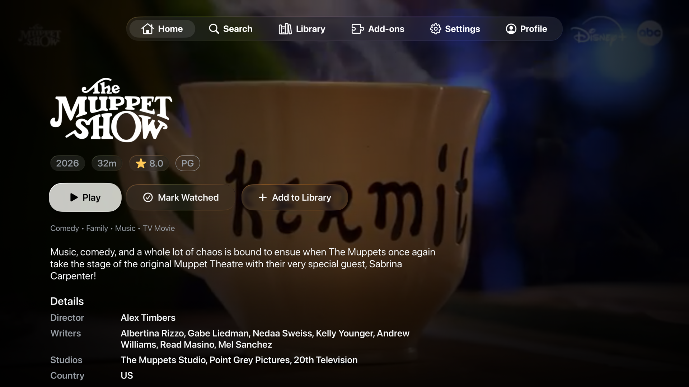 <br/> **Detail** — metadata, ratings & quick actions |
| 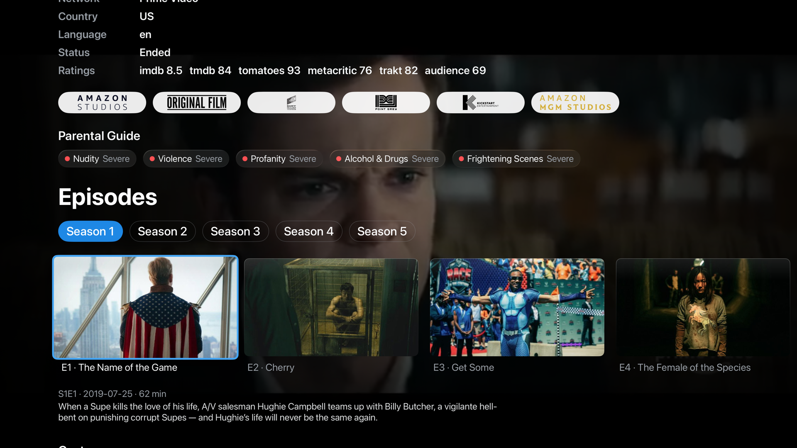 <br/> **Series** — season chips & episode shelf | 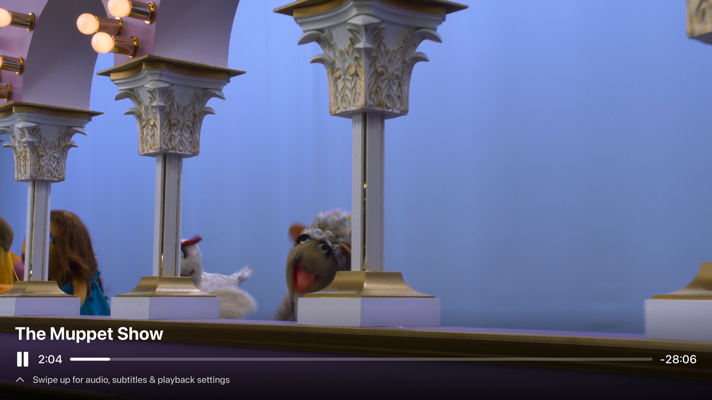 <br/> **Player** — native AVPlayer path, platter-free controls |
| 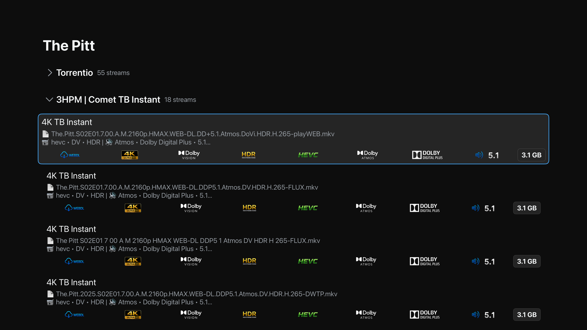 <br/> **Streams** — per-addon groups, debrid-cached & quality badges | 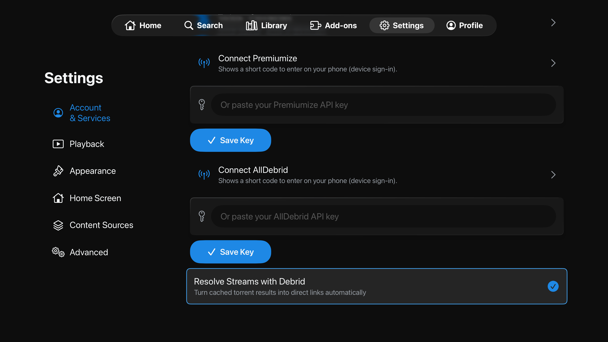 <br/> **Debrid** — TorBox, Premiumize, Real-Debrid & AllDebrid |
| 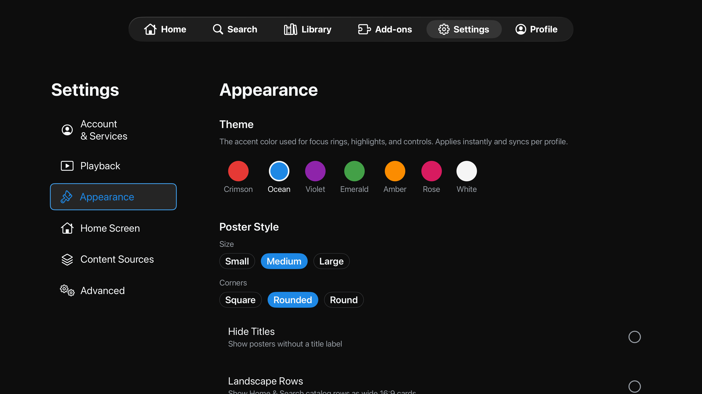 <br/> **Appearance** — accent themes & poster styles, synced per profile | 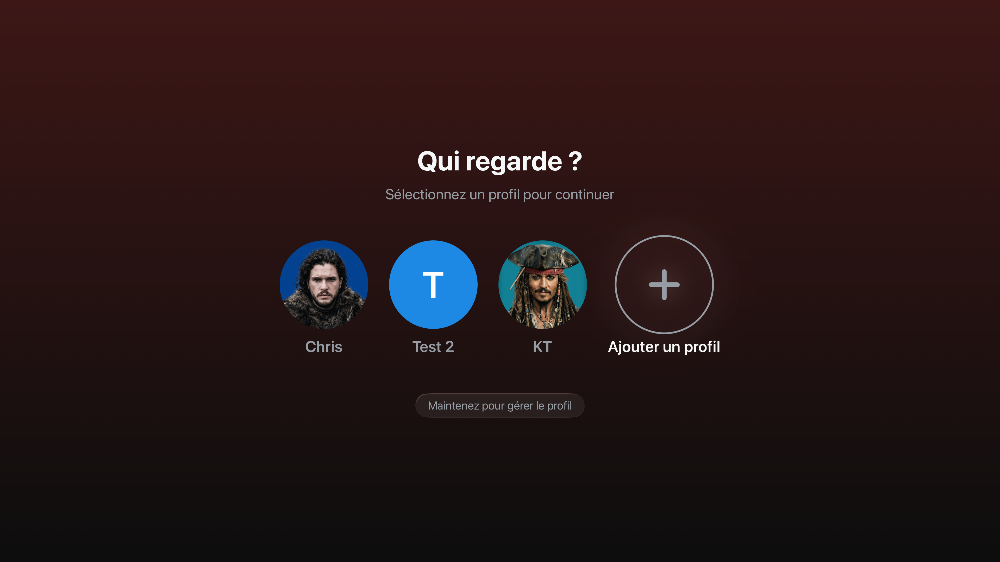 <br/> **Localized** — English, French, Spanish, German, Italian & Vietnamese |
| 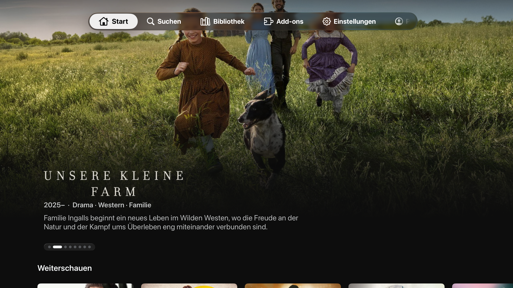 <br/> **Localized hero** — title logos, synopsis & genres in your language via TMDB | 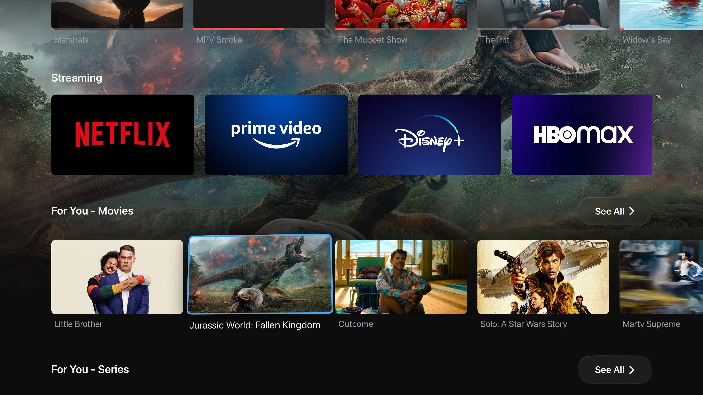 <br/> **Wide rows** — 16:9 cards with titles; the focused card lifts clear |
| 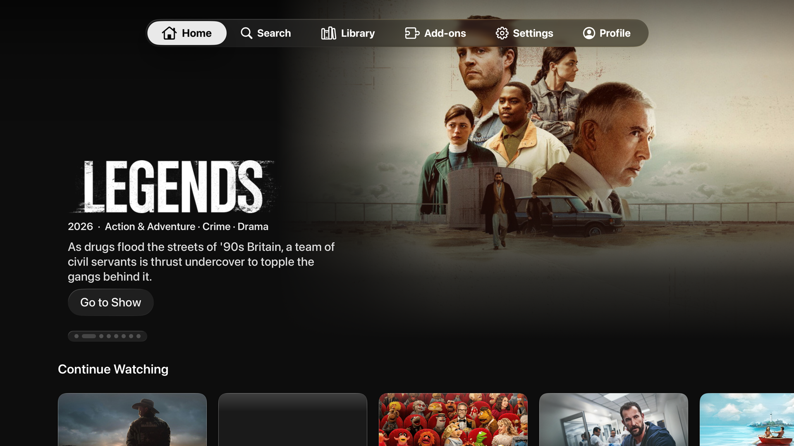 <br/> **Nuvio-Style Hero** (opt-in) — info on the left, artwork blending in from the right | 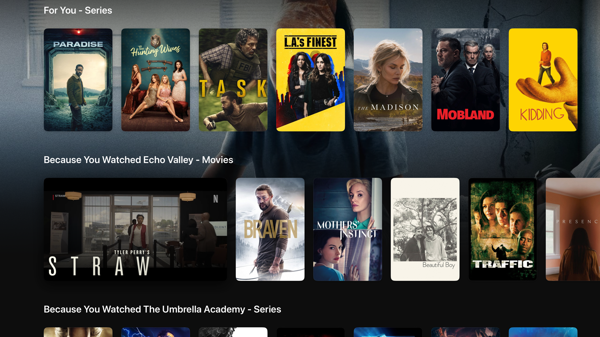 <br/> **Trailers on Focus** — the poster widens in the row and plays the trailer |
| 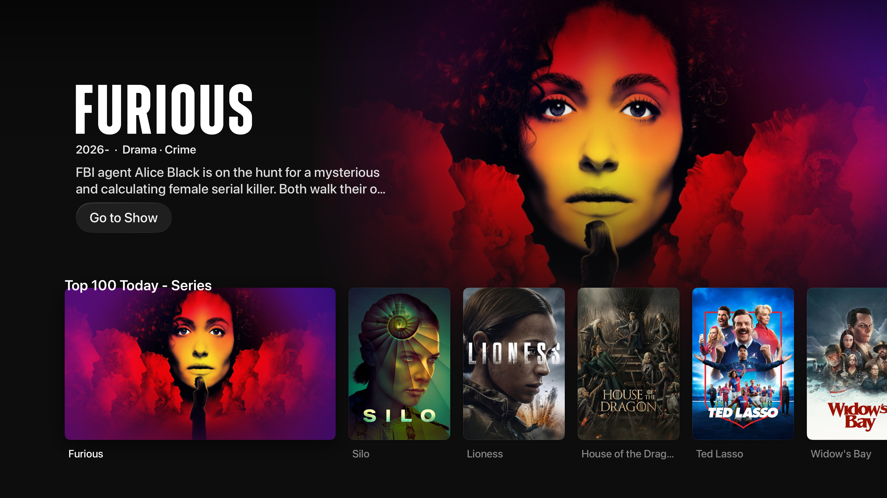 <br/> **Pinned hero** — with Nuvio-Style on, the hero stays put and follows the focused title while only the rows scroll beneath it | |

## Features

### True 10-foot UI

- **Native tvOS design language** — a full Human Interface Guidelines pass: Liquid Glass surfaces, system focus platters and lockups throughout, real Siri-Remote parallax on every card (posters track your thumb on the touch surface), and a reorganized multi-pane Settings.
- **Native SwiftUI** built around the tvOS focus engine — poster cards scale, lift and tilt toward you on focus as one piece, artwork edge and title together (portrait or wide 16:9 layouts, titles always clear), D-pad-first navigation throughout. Prefer stillness? **No Zoom on Focus** (Settings → Appearance) marks the focused card with a border and shadow instead of scaling — and as of this beta it covers every tile (See All cards, episode cards, the detail trailer thumbnail), not just posters. See All grids **and collection folder grids** remember your position when you back out of a title, and expanding a search row's See All shows the actual search results.
- **Home hero carousel** with auto-advance, manual paging by D-pad click or touch-surface swipe (left and right, wrapping), title logo artwork, and a **Go to Movie / Go to Show** button — with a TMDB key, hero titles, synopses and logos arrive in your language. Prefer the look from Nuvio's modern home screen? Flip on **Nuvio-Style Hero** (Settings → Home Screen): title and description on the left, artwork blending in from the right — and new in this beta, the hero is **pinned**: it stays at the top of Home, updating live with the focused title, while only the rows scroll beneath it. **See All** also moved into the rows themselves as a card at the end of each shelf. Pinned rows now sit a little airier so the focused card's lift never clips the row title, and the title glides between rows instead of snapping.
- **Floating pill navigation bar**, horizontal episode shelves, and watched-episode badges.
- **Continue Watching** with a separate Upcoming row for not-yet-released next episodes.
- **Appearance themes** — seven accent colors, poster size/corner styles, landscape rows, and title-label options, applied instantly and synced per profile. New in this beta: **Settings Style** presets (Default / Minimal), **icon-only detail buttons**, a **background-trailer duration** control (30s / 1 min / 90s / always) with a smooth fade back to the backdrop, and a **Trailer Sound by Default** toggle.
- **Full-screen trailers with sound** from the detail page — now up to 1080p, and no more black screen with Match Content Frame Rate enabled. Auto-play, the background trailer, and the poster backdrop layer each have their own toggle — and the detail page now dims toward black as you scroll down into the details.
- **Trailers on Focus** (opt-in, Settings → Home Screen) — hold focus on a poster and it widens into a 16:9 card at the poster's own height, playing the trailer right in the row; play/pause toggles sound. The trailer pipeline keeps no cookies or disk cache between launches now, so a rate-limited session can't outlive a restart.
- **Hero source picker & Home Rows controls** — choose which catalogs feed the hero carousel, reorder Home rows, and collection tiles play their focus GIFs — decoded sharp on 4K panels (HD-parity resolution or better, trading a few frames instead of pixels) and rendering a collection's configured backdrop artwork on the folder tile.
- **System-native tab bar** — minimizes as you scroll into content the way tvOS 26's own apps do, and from deep in the page a single **Menu** press jumps you back to the top (the "long way down, short way back" convention).
- **Top Shelf extension** — your content surfaces directly on the Apple TV home screen (from-source builds only; the sideload IPA omits it because free-Apple-ID re-signing breaks extension signatures).
- **Localized UI** — English, French, Spanish, German, Italian, and — new in this beta — **Vietnamese (Tiếng Việt)**; every language caught up on all recent strings at the same time. With Metadata Language set, the hero and rows arrive already localized (no English-then-French swap), rows localizing their captions as they scroll into view.
- **Settings → About** — version, build number, beta tag and commit at a glance (plus tvOS version and device model), so a bug report can finally say exactly which build it's about.

### Stremio addon ecosystem

- Install **Stremio-compatible addons** for catalogs, metadata, streams, and subtitles.
- An **on-device QuickJS runtime** executes addon logic natively — no external server.
- Install addons in-app or from the web (`stremio://` links are picked up on account sync).
- **Grouped stream picker** — sources collapse into per-addon groups with stream counts and per-group loading, so one slow addon never blocks the list; the focused row expands to show the full release name. Stream badges now stay readable in every theme — including White — whether a row is focused or not.
- **Search Sources** (Settings → Content Sources) — choose exactly which addon catalogs power search, per Apple TV.

### Playback

- **Hybrid player** — a native AVPlayer path with on-device MKV remuxing: **Dolby Vision** (including Profile 7 → 8.1 conversion via libdovi), **TrueHD / DTS audio transcoding**, and full seek-anywhere support.
- **libmpv player** (via MPVKit) for everything else, with HDR tone-mapping (`gpu-next`) — and the screensaver can no longer interrupt playback.
- **External player handoff** — send any stream to **Infuse**, **VLC**, or **Outplayer**, per stream or via a Default Player setting; the handoff carries your resume position and addon subtitles. **VidHub** is listed too, implemented per its x-callback-url docs — but its current tvOS build ignores the handoff (known issue, reported to Oka Apps; it will start working when they fix it).
- **Addon subtitles in both players** (SRT → WebVTT renditions on the native path), with forced/audio-aware subtitle auto-selection and full subtitle styling (color, size, background, outline).
- **Skip intro**, Play Next, next-episode autoplay, and a Stream Info panel (video/audio/subtitle state at a glance).

### Sources & accounts

- **Debrid support** — **TorBox**, **Premiumize**, **Real-Debrid**, and **AllDebrid**; connect with a device code or API key, and cached results resolve to direct streams with quality / codec / service badges in the stream picker.
- **Trakt scrobbling** — movies and episodes marked watched automatically, with Trakt connections isolated per profile.
- **Simkl integration** — connect with a short PIN code (Settings → Accounts & Services) and your watch history scrobbles to Simkl too, with anime resolved through Simkl's own ID mapping (including a picker for ambiguous matches) and a **Sync Now** button for on-demand push/pull.
- **Provider keys sync with your account** — debrid and TMDB API keys follow your Nuvio account to any Apple TV you sign in on (AllDebrid stays device-local).
- **TMDB / MDBList / MyAnimeList** ratings and metadata, catalog-type and release-date display options — plus a **Metadata Language** picker (follow the Apple TV's language, or choose from 12).
- **Profiles with PIN entry** and a QR-code sign-in flow — pair with your phone instead of typing credentials with the Siri Remote.
- **Cloud library sync**, collections, and a sortable library with shelf and grid layouts.
- **A settings slot of its own** — NuvioTV now syncs its settings under a dedicated namespace, so sharing an account with Nuvio on another TV platform can't flip options back and forth between the two apps.

## Requirements

- An **Apple TV** running **tvOS 26** or later (or the Apple TV simulator).
- **macOS** with **Xcode 26** or later.
- A recent **JDK**, used by Gradle to build the `SharedCore` Kotlin framework.

## Installation (Beta)

Beta builds ship as an **unsigned tvOS IPA** on the [**Releases page**](https://github.com/youngchris29-art/NuvioTV/releases/latest) — no paid Apple Developer account needed. You sideload it with a **free Apple ID**; the signature is created on your machine at install time. For detailed step-by-step instructions (including wireless setup and the 7-day refresh), see [**INSTALL.md**](INSTALL.md).

1. Download `NuvioTV.ipa` from the [latest release](https://github.com/youngchris29-art/NuvioTV/releases/latest).
2. Sideload it to your Apple TV with one of:
   - [**Sideloadly**](https://sideloadly.io/) (Mac / Windows) — detects Apple TVs over the local network; pair the Apple TV if prompted (Settings → Remotes and Devices → Remote App and Devices shows the pairing code). If you hit an "App ID limit" error, remove an old sideloaded app first (free Apple IDs allow 3 at a time).
   - [**atvloadly**](https://github.com/bitxeno/atvloadly) — a self-hosted (Docker) web UI that sideloads over the network and can re-sign automatically.
3. On first launch, trust the developer certificate on the Apple TV (Settings → General → Privacy & Security).

> **Free Apple ID limits** (normal, not bugs): the app's signature expires after **7 days** — just re-sideload (both tools can automate the refresh) — and a free account allows at most **3 sideloaded apps** at a time.

Every beta is a fresh build with no account or addons baked in — sign in and set up your own sources on first launch. Prefer building from source? See [Development](#development) below.

## Development

```bash
# 1. Clone with submodules (pulls the NuvioMobile core; MPVKit lives inside it)
git clone --recurse-submodules https://github.com/youngchris29-art/NuvioTV.git
cd NuvioTV/NuvioMobile
git submodule update --init --recursive

# 2. One-time: build the tvOS QuickJS runtime into your local Maven
../scaffolding/build-quickjs-tvos.sh

# 3. Open the Xcode project, then build & run the NuvioTV scheme on an Apple TV
open iosApp/iosApp.xcodeproj
```

Building the app triggers the Gradle task that produces the `SharedCore` framework and links it into the tvOS target. For the full setup and architecture, see [`docs/tvos-port-plan.md`](docs/tvos-port-plan.md) and [`scaffolding/README.md`](scaffolding/README.md).

Versioning is driven from [`NuvioMobile/iosApp/Configuration/Version.xcconfig`](NuvioMobile/iosApp/Configuration/Version.xcconfig), the shared source of truth for both the mobile and tvOS builds.

### Project Structure

- `NuvioMobile/` — the shared Nuvio core as a Git submodule (this fork's `tvos-shared-extraction` branch); holds the Kotlin Multiplatform code and the Xcode project.
  - `NuvioMobile/shared/` — the UI-free **`SharedCore`** KMP framework (domain + data layer) consumed by the tvOS app.
  - `NuvioMobile/iosApp/NuvioTV/` — the native **SwiftUI** tvOS app (`Screens/`, `DesignSystem/`, `Bridge/`).
  - `NuvioMobile/iosApp/NuvioTopShelf/` — the tvOS **Top Shelf** extension.
  - `NuvioMobile/iosApp/iosApp.xcodeproj` — the Xcode project; build the **`NuvioTV`** scheme.
- `design/` — brand assets (logo, marks, previews).
- `docs/` — port plan, feature-parity roadmap, and scouting / migration reports.
- `scaffolding/` — Phase 0 templates and the tvOS QuickJS build script / patch.

## Built With

- SwiftUI + the tvOS focus engine
- Kotlin Multiplatform (`SharedCore`)
- AVFoundation / AVKit
- libmpv via [MPVKit](https://github.com/mpvkit/MPVKit)
- Ktor + kotlinx-serialization
- Supabase (auth / postgrest / functions)
- QuickJS (`quickjs-kt`, tvOS fork) for the Stremio addon runtime

## Credits & Upstream

NuvioTV stands on the shoulders of the Nuvio project:

- [**NuvioMedia/NuvioMobile**](https://github.com/NuvioMedia/NuvioMobile) — the Kotlin / Compose Multiplatform app this fork extends and tracks. `SharedCore` is built from its domain / data layer, and this repo periodically merges upstream changes.
- [**tapframe/NuvioTV**](https://github.com/tapframe/NuvioTV) — the original React Native app that started it all.

This is an independent, community fork focused on Apple TV. It is not affiliated with or endorsed by the upstream maintainers.

## Legal & DMCA

Nuvio functions solely as a client-side interface for browsing metadata and playing media provided by user-installed extensions and/or user-provided sources. It is intended for content the user owns or is otherwise authorized to access.

Nuvio is not affiliated with any third-party extensions, catalogs, sources, or content providers. It does not host, store, or distribute any media content.

For comprehensive legal information, including the full disclaimer, third-party extension policy, and DMCA / Copyright information, please visit the [Legal & Disclaimer Page](https://nuvioapp.space/legal).

## License

Distributed under the **GNU General Public License v3.0**, inherited from [NuvioMobile](https://github.com/NuvioMedia/NuvioMobile/blob/main/LICENSE). See [`NuvioMobile/LICENSE`](NuvioMobile/LICENSE).

## Star History

<a href="https://www.star-history.com/#youngchris29-art/NuvioTV&type=date&legend=top-left">
 <picture>
   <source media="(prefers-color-scheme: dark)" srcset="https://api.star-history.com/svg?repos=youngchris29-art/NuvioTV&type=date&theme=dark&legend=top-left" />
   <source media="(prefers-color-scheme: light)" srcset="https://api.star-history.com/svg?repos=youngchris29-art/NuvioTV&type=date&legend=top-left" />
   
 </picture>
</a>

<!-- MARKDOWN LINKS & IMAGES -->
[contributors-shield]: https://img.shields.io/github/contributors/youngchris29-art/NuvioTV.svg?style=for-the-badge
[contributors-url]: https://github.com/youngchris29-art/NuvioTV/graphs/contributors
[forks-shield]: https://img.shields.io/github/forks/youngchris29-art/NuvioTV.svg?style=for-the-badge
[forks-url]: https://github.com/youngchris29-art/NuvioTV/network/members
[stars-shield]: https://img.shields.io/github/stars/youngchris29-art/NuvioTV.svg?style=for-the-badge
[stars-url]: https://github.com/youngchris29-art/NuvioTV/stargazers
[issues-shield]: https://img.shields.io/github/issues/youngchris29-art/NuvioTV.svg?style=for-the-badge
[issues-url]: https://github.com/youngchris29-art/NuvioTV/issues
[license-shield]: https://img.shields.io/github/license/youngchris29-art/NuvioTV.svg?style=for-the-badge
[license-url]: https://github.com/youngchris29-art/NuvioTV/blob/main/LICENSE
