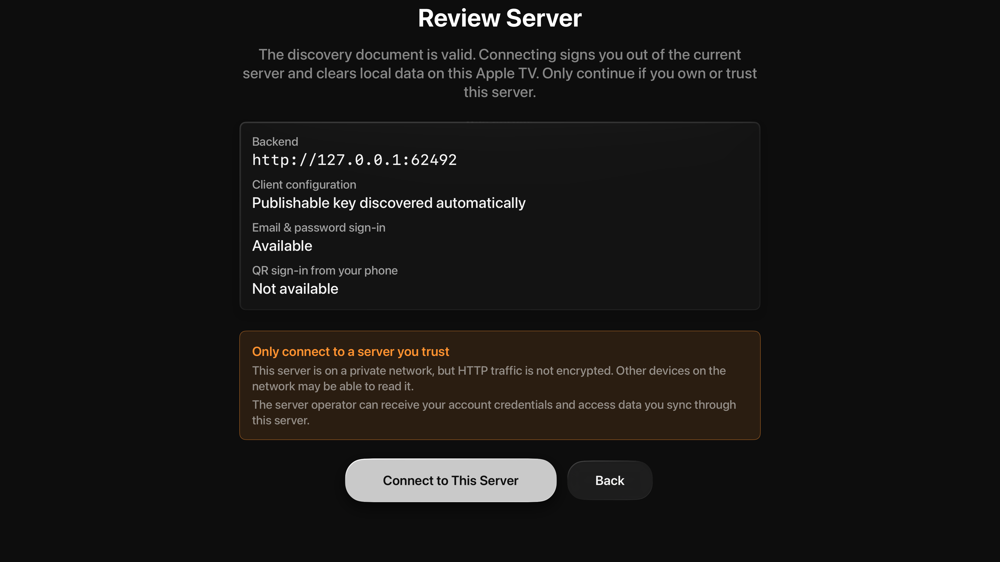
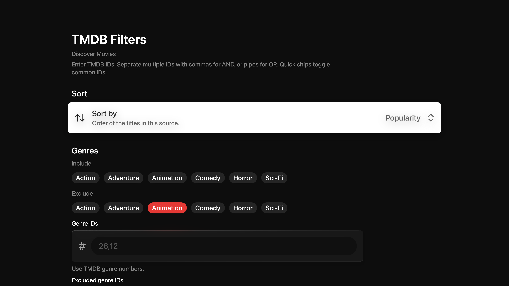
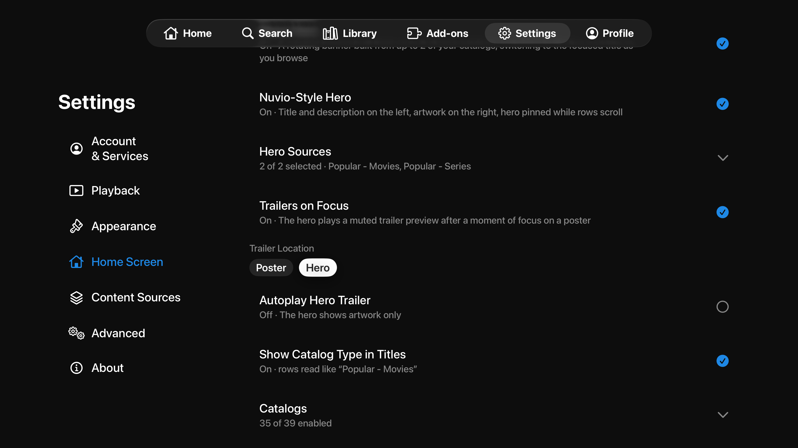
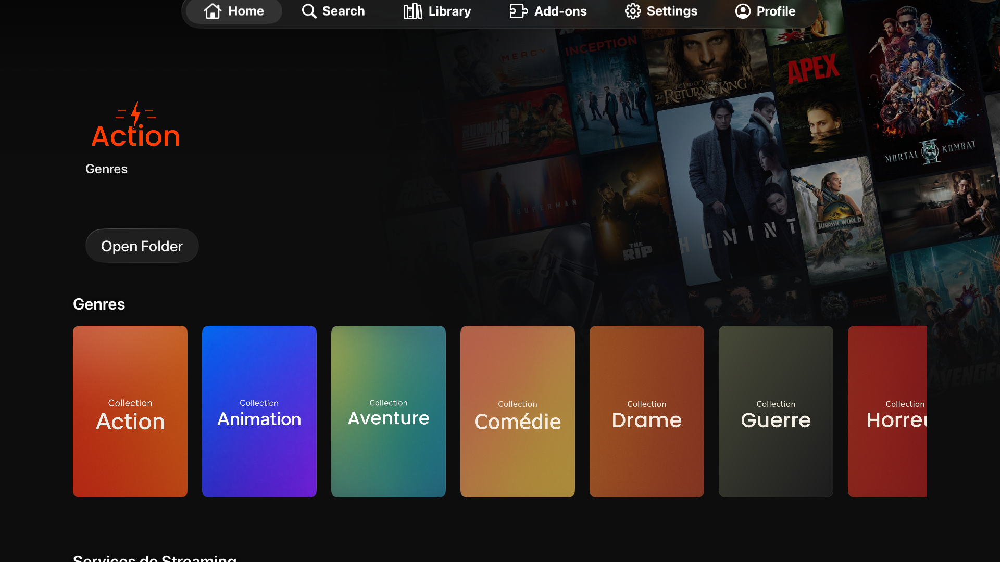
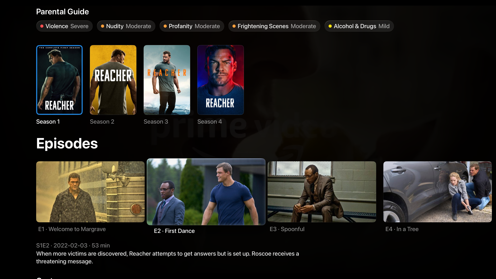

<div align="center">

  
  <br />
  <br />

  [![Contributors][contributors-shield]][contributors-url]
  [![Forks][forks-shield]][forks-url]
  [![Stargazers][stars-shield]][stars-url]
  [![Issues][issues-shield]][issues-url]
  [![License][license-shield]][license-url]

  <p>
    A native Apple TV client for the Nuvio media hub — SwiftUI on top of a shared Kotlin Multiplatform core.
    <br />
    Stremio addon ecosystem • Built for the tvOS focus engine &amp; Siri Remote
  </p>

</div>

## About

**NuvioTV** is a native **tvOS (Apple TV)** port of [Nuvio](https://github.com/NuvioMedia/NuvioMobile). It brings Nuvio's playback-focused experience — the Stremio addon ecosystem, catalogs, watch progress, collections, cloud library, debrid, and Trakt — to the living room with an interface designed from the ground up for the **tvOS focus engine** and the **Siri Remote**.

Rather than port the touch UI, this fork keeps only what travels well: the proven, Compose-free **domain and data layer** from NuvioMobile is lifted into a UI-free Kotlin Multiplatform framework — **`SharedCore`** — and a brand-new **SwiftUI** frontend is built on top of it. The result is one shared business-logic core across mobile and TV, with a purpose-built 10-foot experience on Apple TV.

> **Lineage:** the original *NuvioTV* was a React Native app; it was rewritten as [**NuvioMobile**](https://github.com/NuvioMedia/NuvioMobile) (Kotlin / Compose Multiplatform) for Android and iOS. This project reclaims the *NuvioTV* name for a true Apple TV app — sharing NuvioMobile's core while replacing the UI and player for tvOS.

## Screenshots

| | |
|:---:|:---:|
|  <br/> **Home** — hero carousel & Continue Watching |  <br/> **Search** — Discover rows from your addons |
|  <br/> **Catalogs** — addon catalogs with filter chips |  <br/> **Detail** — metadata, ratings & quick actions |
|  <br/> **Series** — season chips & episode shelf |  <br/> **Player** — native AVPlayer path, platter-free controls |
|  <br/> **Streams** — per-addon groups, debrid-cached & quality badges |  <br/> **Debrid** — TorBox, Premiumize, Real-Debrid & AllDebrid |
|  <br/> **Appearance** — accent themes & poster styles, synced per profile |  <br/> **Localized** — English, French, Spanish, German, Italian & Vietnamese |
|  <br/> **Localized hero** — title logos, synopsis & genres in your language via TMDB |  <br/> **Wide rows** — 16:9 cards with titles; the focused card lifts clear |
|  <br/> **Nuvio-Style Hero** (opt-in) — info on the left, artwork blending in from the right |  <br/> **Trailers on Focus** — the poster widens in the row and plays the trailer; with titles hidden, the logo rides the tile |
|  <br/> **Pinned hero** — with Nuvio-Style on, the hero stays put and follows the focused title while only the rows scroll beneath it |  <br/> **Self-hosted servers** — point the app at your own backend; discovery, capabilities & a trust review before switching |
|  <br/> **TMDB filters on the TV** — edit a Discover folder's filters (incl. exclusions) right on the Apple TV; edits sync to your account |  <br/> **Trailer Location** — play the focused title's trailer in the hero instead of morphing the poster; Autoplay Hero Trailer needs no focus at all |
|  <br/> **Collection artwork in the hero** — focus a collection tile and the hero takes that folder's backdrop and title logo |  <br/> **Season posters** — the season row now matches the More Like This tile size |

## Features

### True 10-foot UI

- **Native tvOS design language** — a full Human Interface Guidelines pass: Liquid Glass surfaces, system focus platters and lockups throughout, real Siri-Remote parallax on every card (posters track your thumb on the touch surface), and a reorganized multi-pane Settings.
- **Native SwiftUI** built around the tvOS focus engine — poster cards scale, lift and tilt toward you on focus as one piece, artwork edge and title together (portrait or wide 16:9 layouts, titles always clear), D-pad-first navigation throughout. Prefer stillness? **No Zoom on Focus** (Settings → Appearance) marks the focused card with a border and shadow instead of scaling — and it covers every tile (See All cards, episode cards, the detail trailer thumbnail), not just posters. See All grids **and collection folder grids** remember your position when you back out of a title, and expanding a search row's See All shows the actual search results.
- **Home hero carousel** with auto-advance, manual paging by D-pad click or touch-surface swipe (left and right, wrapping), title logo artwork, and a **Go to Movie / Go to Show** button — with a TMDB key, hero titles, synopses and logos arrive in your language. Prefer the look from Nuvio's modern home screen? Flip on **Nuvio-Style Hero** (Settings → Home Screen): title and description on the left, artwork blending in from the right — and the hero is **pinned**: it stays at the top of Home, updating live with the focused title, while only the rows scroll beneath it. **See All** also moved into the rows themselves as a card at the end of each shelf. Pinned rows now sit a little airier so the focused card's lift never clips the row title, and the title glides between rows instead of snapping.
- **Floating pill navigation bar**, horizontal episode shelves, and watched-episode badges. **Bigger season posters** on the series page — 180×270, the same size as More Like This, with the same card depth as every other tile.
- **Continue Watching** with a separate Upcoming row for episodes airing in the next two weeks. New in this beta: the row is built with the **same rules as Nuvio mobile** — same titles, same order, up to 300 entries, hidden shows filtered out, the same recency window — and the Top Shelf mirrors it; the Upcoming row also keeps its footing when you switch watch-progress sources instead of vanishing.
- **Appearance themes** — seven accent colors, poster size/corner styles, landscape rows, and title-label options, applied instantly and synced per profile. The theme picker's focused swatch name is legible again on every theme, and **Card Depth → Edge Coverage: Top** draws a visible lit-from-above rail (it was a hairline you couldn't see from the couch; Full is unchanged). **Settings Style** presets (Default / Minimal), **icon-only detail buttons**, a **background-trailer duration** control (30s / 1 min / 90s / always) with a smooth fade back to the backdrop, and a **Trailer Sound by Default** toggle. New in this beta: **Settings rebuilt on tvOS's native controls** — real Lists, switches and dropdown pickers like the Apple TV's own Settings app, your accent color threaded through the glyphs, values and sidebar, and focus that stays put (picking a theme swatch no longer throws you back to the top).
- **Full-screen trailers with sound** from the detail page — now up to 1080p, and no more black screen with Match Content Frame Rate enabled. Auto-play, the background trailer, and the poster backdrop layer each have their own toggle — and the detail page now dims toward black as you scroll down into the details.
- **Trailers on Focus** (opt-in, Settings → Home Screen) — hold focus on a poster and it widens into a 16:9 card at the poster's own height, playing the trailer right in the row; play/pause toggles sound. **Trailer Location: Poster / Hero** — with Hero selected (and the Nuvio-Style hero on), the poster stays put and the trailer plays in the hero backdrop, which already follows your focus; play/pause on the poster still toggles sound, Search keeps the poster morph, and the Settings summary names whichever surface is actually in use. Also new: **Autoplay Hero Trailer** (off by default) — the hero carousel's featured title plays its trailer with no focus required, hands over when you focus a poster, and goes quiet under a detail page, a tab switch or the stream picker. With **Hide Titles** on, the title's logo (or name) now stays on the playing tile — bottom-left over a soft scrim, the way Nuvio's TV app shows it — instead of the trailer playing nameless. The trailer pipeline keeps no cookies or disk cache between launches, so a rate-limited session can't outlive a restart.
- **Hero source picker & Home Rows controls** — choose which catalogs feed the hero carousel, reorder Home rows, and collection tiles play their focus GIFs — decoded sharp on 4K panels (HD-parity resolution or better, trading a few frames instead of pixels) and rendering a collection's configured backdrop artwork on the folder tile. **Collection artwork on the Home page** — focus a collection tile and the hero takes that folder's configured backdrop and title logo (the fields Fusion community collections carry, which no Nuvio client rendered before), with the collection's name as the meta line and an Open Folder button; inside the folder the title logo is the page title.
- **System-native tab bar** — minimizes as you scroll into content the way tvOS 26's own apps do, and from deep in the page a single **Menu** press jumps you back to the top (the "long way down, short way back" convention).
- **Top Shelf extension** — your content surfaces directly on the Apple TV home screen (from-source builds only; the sideload IPA omits it because free-Apple-ID re-signing breaks extension signatures).
- **Localized UI** — English, French, Spanish, German, Italian, and **Vietnamese (Tiếng Việt)**; every language caught up on all recent strings at the same time. With Metadata Language set, the hero and rows arrive already localized (no English-then-French swap), rows localizing their captions as they scroll into view.
- **Settings → About** — version, build number, beta tag and commit at a glance (plus tvOS version and device model), so a bug report can finally say exactly which build it's about.

### Stremio addon ecosystem

- Install **Stremio-compatible addons** for catalogs, metadata, streams, and subtitles.
- An **on-device QuickJS runtime** executes addon logic natively — no external server.
- Install addons in-app or from the web (`stremio://` links are picked up on account sync).
- **Grouped stream picker** — sources collapse into per-addon groups with stream counts and per-group loading, so one slow addon never blocks the list; the focused row expands to show the full release name. Stream badges now stay readable in every theme — including White — whether a row is focused or not. **Header-gated addon streams play** — streams that declare required HTTP headers (a Referer or User-Agent their CDN checks) now pass them to both players, matching Nuvio mobile. New in this beta: titles opened from TMDB-backed rows **resolve streams reliably** — addons are asked with an id they actually accept, and removing an addon now asks for confirmation first.
- **Search Sources** (Settings → Content Sources) — choose exactly which addon catalogs power search, per Apple TV. **Hide Discover** hides the whole Discover section on the Search page (synced per profile) for a bare search field, if your Home already carries your genres. New in this beta: the Discover section **remembers your last-picked catalog** across launches instead of resetting to the first one.

### Playback

- **Native player, on by default** — an AVPlayer path with on-device MKV remuxing: **Dolby Vision** (including Profile 7 → 8.1 conversion via libdovi), **TrueHD / DTS audio transcoding**, and full seek-anywhere support. **Swipe down (or press down) for the classic top panel** — Nuvio draws it itself, since tvOS 26's player no longer has one: an **Info** tab (poster, title, episode name, synopsis, a metadata strip — runtime · 4K · Dolby Vision · codec · audio · bitrate — and live stream details), a **Subtitles** tab listing the file's **embedded subtitle tracks** alongside your addon subtitles (Off first; forced and SDH flagged), and an **Audio** tab listing **every audio track** in the file — switching is instant, no rebuild — plus your current speakers/headphones with a route picker. Menu closes the panel; the native transport-bar Subtitles/Audio buttons stay for tvOS extras like Enhance Dialogue and Reduce Loud Sounds. Preferred Audio / Subtitle Language still apply on start. The mpv player has the **same panel** (its old swipe-up menu is gone) plus a fourth **Playback** tab: speed, subtitle/audio delay, diagnostics, episode jump list and alternate sources.
- **libmpv player** (via MPVKit) for everything else, with HDR tone-mapping (`gpu-next`) — and the screensaver can no longer interrupt playback.
- **External player handoff** — send any stream to **Infuse**, **VLC**, or **Outplayer**, per stream or via a Default Player setting; the handoff carries your resume position and addon subtitles. **VidHub** is listed too, implemented per its x-callback-url docs — but its current tvOS build ignores the handoff (known issue, reported to Oka Apps; it will start working when they fix it).
- **Addon subtitles in both players** (SRT → WebVTT renditions on the native path; embedded MKV text tracks are extracted on the fly as segmented WebVTT), with forced/audio-aware subtitle auto-selection and full subtitle styling (color, size, background, outline) — "Show only preferred languages" now trims the native Subtitles tab too. A **Strip SDH Subtitles** toggle (Settings → Playback) hides `[sound cues]`, `(asides)` and speaker labels from text subtitles, in both players. New in this beta: a **Subtitle Timing** row in the player's Subtitles tab — nudge subtitles earlier or later in 100 ms steps until they sit on the audio, in **both** players, remembered **per title** across replays and kept separate per profile, with a Reset that also sticks.
- **Skip Intro / Recap / Outro** and **Play Next Episode** as Apple's own contextual-action pills (bottom-right, focusable) with a small countdown caption above them, next-episode autoplay, and the Info tab's live stream rows (engine, codecs, resolution, active audio/subtitle, bitrate, transfer). The mpv player draws matching chips.

### Sources & accounts

- **Debrid support** — **TorBox**, **Premiumize**, **Real-Debrid**, and **AllDebrid**; connect with a device code or API key, and cached results resolve to direct streams with quality / codec / service badges in the stream picker.
- **Trakt scrobbling** — movies and episodes marked watched automatically, with Trakt connections isolated per profile.
- **Simkl integration** — connect with a short PIN code (Settings → Accounts & Services) and your watch history scrobbles to Simkl too, with anime resolved through Simkl's own ID mapping (including a picker for ambiguous matches) and a **Sync Now** button for on-demand push/pull. New in this beta: anime added to a Simkl **list** is classified as anime too (a title misfiled before this build corrects itself the next time you touch it).
- **Provider keys sync with your account** — debrid and TMDB API keys follow your Nuvio account to any Apple TV you sign in on (AllDebrid stays device-local). New in this beta: your **Library and Watch Progress source choices sync across devices too** — switch your scrobbler from Trakt to Simkl anywhere and every Apple TV follows, Continue Watching window included — and the app now **refreshes account data in the background** while open and on every foreground, so changes made on other devices arrive without a relaunch.
- **TMDB / MDBList / MyAnimeList** ratings and metadata, catalog-type and release-date display options — plus a **Metadata Language** picker (follow the Apple TV's language, or choose from 12).
- **Profiles with PIN entry** and a QR-code sign-in flow — pair with your phone instead of typing credentials with the Siri Remote.
- **Self-hosted servers** — point the Apple TV at your own Nuvio backend (the [official self-host stack](https://github.com/NuvioMedia/self-host)). From the welcome screen or Settings → Account & Services, enter the backend URL; the app reads its `/.well-known/nuvio` discovery document, shows you what it found (backend, sign-in methods, a trust warning for public hosts or plain HTTP) and, once you confirm, signs out of the current server, clears local data and reconnects. QR sign-in follows the server's `tv_login` capability (the approve page moves to `<backend>/tv-login`; email & password is offered when a server lacks it), and **Use Official Server** switches back any time.
- **Cloud library sync**, collections, and a sortable library with shelf and grid layouts. **TMDB Discover filters are editable on the TV** — open a collection folder backed by a TMDB Discover / company / network source and press **Edit Filters**: sort order, genres, keywords, studios, networks, watch providers (+ region), dates, ratings, language and country — including the new *exclude* filters (excluded genres / keywords / companies / watch providers, matching Nuvio mobile) — with quick chips for the common IDs and your changes syncing back to the account.
- **A settings slot of its own** — NuvioTV now syncs its settings under a dedicated namespace, so sharing an account with Nuvio on another TV platform can't flip options back and forth between the two apps.

## Requirements

- An **Apple TV** running **tvOS 26** or later (or the Apple TV simulator).
- **macOS** with **Xcode 26** or later.
- A recent **JDK**, used by Gradle to build the `SharedCore` Kotlin framework.

## Installation (Beta)

Beta builds ship as an **unsigned tvOS IPA** on the [**Releases page**](https://github.com/youngchris29-art/NuvioTV/releases/latest) — no paid Apple Developer account needed. You sideload it with a **free Apple ID**; the signature is created on your machine at install time. For detailed step-by-step instructions (including wireless setup and the 7-day refresh), see [**INSTALL.md**](INSTALL.md).

1. Download `NuvioTV.ipa` from the [latest release](https://github.com/youngchris29-art/NuvioTV/releases/latest).
2. Sideload it to your Apple TV with one of:
   - [**Sideloadly**](https://sideloadly.io/) (Mac / Windows) — detects Apple TVs over the local network; pair the Apple TV if prompted (Settings → Remotes and Devices → Remote App and Devices shows the pairing code). If you hit an "App ID limit" error, remove an old sideloaded app first (free Apple IDs allow 3 at a time).
   - [**atvloadly**](https://github.com/bitxeno/atvloadly) — a self-hosted (Docker) web UI that sideloads over the network and can re-sign automatically.
3. On first launch, trust the developer certificate on the Apple TV (Settings → General → Privacy & Security).

> **Free Apple ID limits** (normal, not bugs): the app's signature expires after **7 days** — just re-sideload (both tools can automate the refresh) — and a free account allows at most **3 sideloaded apps** at a time.

Every beta is a fresh build with no account or addons baked in — sign in and set up your own sources on first launch. Prefer building from source? See [Development](#development) below.

## Development

```bash
# 1. Clone with submodules (pulls the NuvioMobile core; MPVKit lives inside it)
git clone --recurse-submodules https://github.com/youngchris29-art/NuvioTV.git
cd NuvioTV/NuvioMobile
git submodule update --init --recursive

# 2. One-time: build the tvOS QuickJS runtime into your local Maven
../scaffolding/build-quickjs-tvos.sh

# 3. Open the Xcode project, then build & run the NuvioTV scheme on an Apple TV
open iosApp/iosApp.xcodeproj
```

Building the app triggers the Gradle task that produces the `SharedCore` framework and links it into the tvOS target. For the full setup and architecture, see [`docs/tvos-port-plan.md`](docs/tvos-port-plan.md) and [`scaffolding/README.md`](scaffolding/README.md).

Versioning is driven from [`NuvioMobile/iosApp/Configuration/Version.xcconfig`](NuvioMobile/iosApp/Configuration/Version.xcconfig), the shared source of truth for both the mobile and tvOS builds.

### Project Structure

- `NuvioMobile/` — the shared Nuvio core as a Git submodule (this fork's `tvos-shared-extraction` branch); holds the Kotlin Multiplatform code and the Xcode project.
  - `NuvioMobile/shared/` — the UI-free **`SharedCore`** KMP framework (domain + data layer) consumed by the tvOS app.
  - `NuvioMobile/iosApp/NuvioTV/` — the native **SwiftUI** tvOS app (`Screens/`, `DesignSystem/`, `Bridge/`).
  - `NuvioMobile/iosApp/NuvioTopShelf/` — the tvOS **Top Shelf** extension.
  - `NuvioMobile/iosApp/iosApp.xcodeproj` — the Xcode project; build the **`NuvioTV`** scheme.
- `design/` — brand assets (logo, marks, previews).
- `docs/` — port plan, feature-parity roadmap, and scouting / migration reports.
- `scaffolding/` — Phase 0 templates and the tvOS QuickJS build script / patch.

## Built With

- SwiftUI + the tvOS focus engine
- Kotlin Multiplatform (`SharedCore`)
- AVFoundation / AVKit
- libmpv via [MPVKit](https://github.com/mpvkit/MPVKit)
- Ktor + kotlinx-serialization
- Supabase (auth / postgrest / functions)
- QuickJS (`quickjs-kt`, tvOS fork) for the Stremio addon runtime

## Credits & Upstream

NuvioTV stands on the shoulders of the Nuvio project:

- [**NuvioMedia/NuvioMobile**](https://github.com/NuvioMedia/NuvioMobile) — the Kotlin / Compose Multiplatform app this fork extends and tracks. `SharedCore` is built from its domain / data layer, and this repo periodically merges upstream changes.
- [**tapframe/NuvioTV**](https://github.com/tapframe/NuvioTV) — the original React Native app that started it all.

This is an independent, community fork focused on Apple TV. It is not affiliated with or endorsed by the upstream maintainers.

## Legal & DMCA

Nuvio functions solely as a client-side interface for browsing metadata and playing media provided by user-installed extensions and/or user-provided sources. It is intended for content the user owns or is otherwise authorized to access.

Nuvio is not affiliated with any third-party extensions, catalogs, sources, or content providers. It does not host, store, or distribute any media content.

For comprehensive legal information, including the full disclaimer, third-party extension policy, and DMCA / Copyright information, please visit the [Legal & Disclaimer Page](https://nuvioapp.space/legal).

## License

Distributed under the **GNU General Public License v3.0**, inherited from [NuvioMobile](https://github.com/NuvioMedia/NuvioMobile/blob/main/LICENSE). See [`NuvioMobile/LICENSE`](NuvioMobile/LICENSE).

## Star History

<a href="https://www.star-history.com/#youngchris29-art/NuvioTV&type=date&legend=top-left">
 <picture>
   <source media="(prefers-color-scheme: dark)" srcset="https://api.star-history.com/svg?repos=youngchris29-art/NuvioTV&type=date&theme=dark&legend=top-left" />
   <source media="(prefers-color-scheme: light)" srcset="https://api.star-history.com/svg?repos=youngchris29-art/NuvioTV&type=date&legend=top-left" />
   
 </picture>
</a>

<!-- MARKDOWN LINKS & IMAGES -->
[contributors-shield]: https://img.shields.io/github/contributors/youngchris29-art/NuvioTV.svg?style=for-the-badge
[contributors-url]: https://github.com/youngchris29-art/NuvioTV/graphs/contributors
[forks-shield]: https://img.shields.io/github/forks/youngchris29-art/NuvioTV.svg?style=for-the-badge
[forks-url]: https://github.com/youngchris29-art/NuvioTV/network/members
[stars-shield]: https://img.shields.io/github/stars/youngchris29-art/NuvioTV.svg?style=for-the-badge
[stars-url]: https://github.com/youngchris29-art/NuvioTV/stargazers
[issues-shield]: https://img.shields.io/github/issues/youngchris29-art/NuvioTV.svg?style=for-the-badge
[issues-url]: https://github.com/youngchris29-art/NuvioTV/issues
[license-shield]: https://img.shields.io/github/license/youngchris29-art/NuvioTV.svg?style=for-the-badge
[license-url]: https://github.com/youngchris29-art/NuvioTV/blob/main/LICENSE
